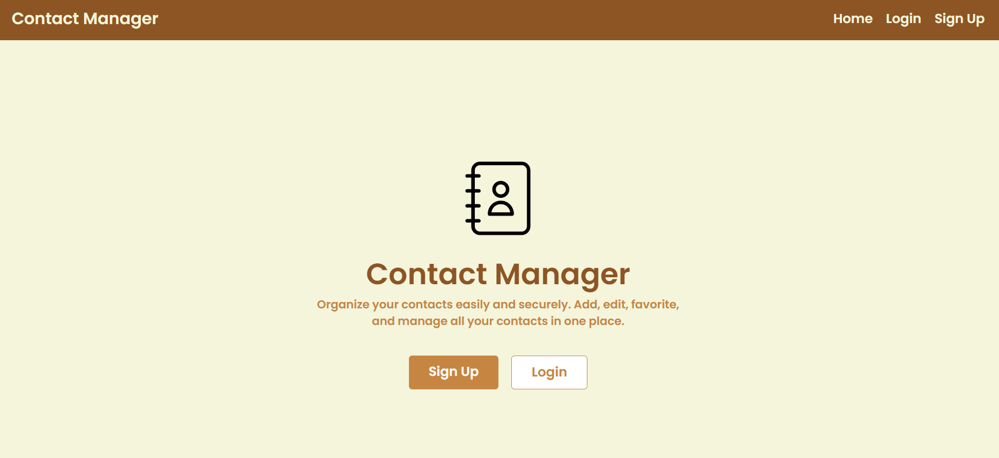
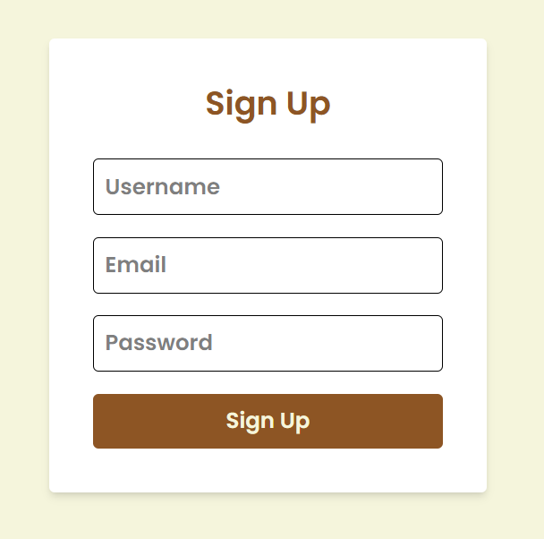
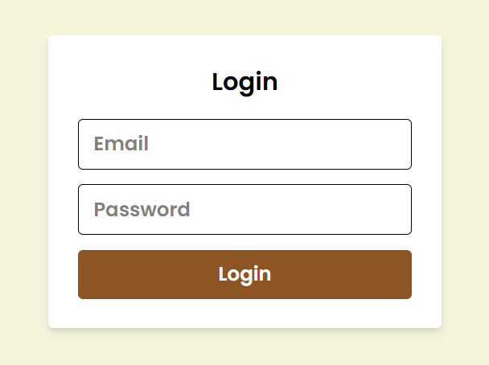
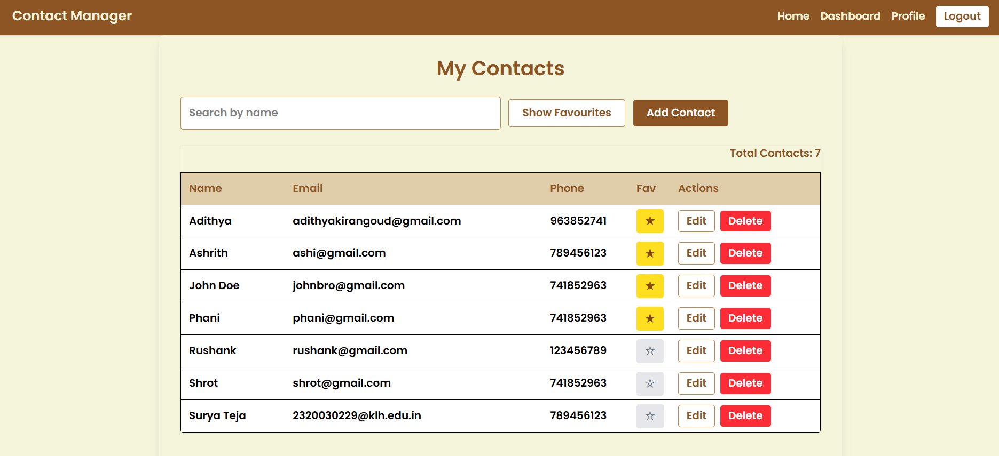
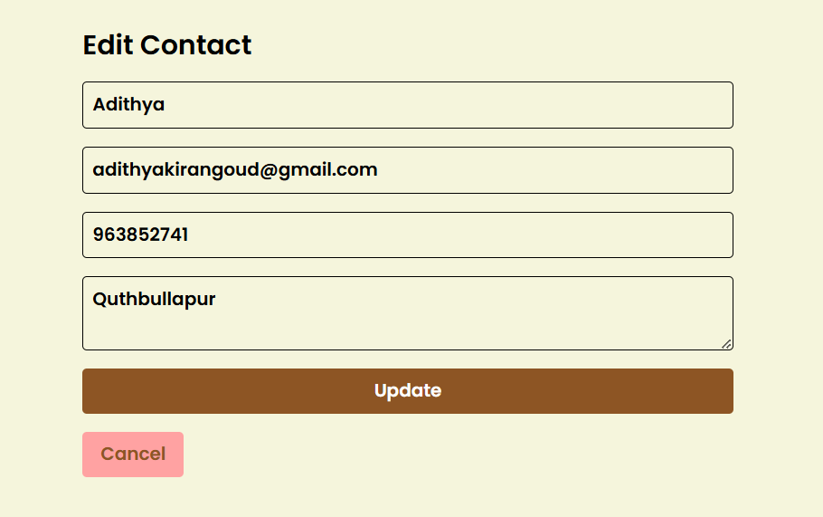
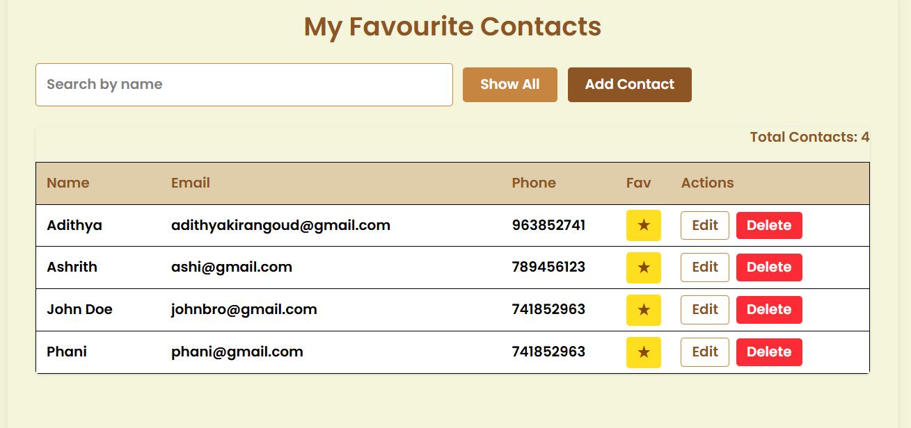
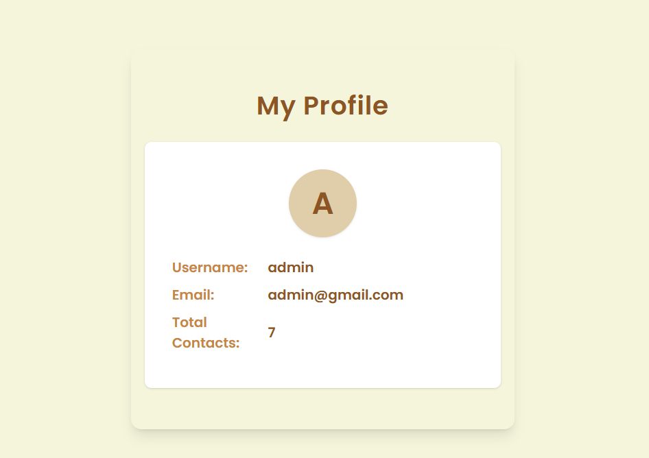

# 📇 Contact Management System

A full-stack **Contact Management System** built with the **MERN Stack** (**MongoDB**, **Express.js**, **React**, **Node.js**).  
This app allows users to **add**, **view**, **edit**, **delete**, **search**, and **sort** contacts through a clean and responsive UI.

---

## 🔥 Features

- ✅ List all contacts with name, phone, and email
- ✅ Add new contacts with validations
- ✅ Edit existing contact details
- ✅ Delete contacts
- ✅ Mark/unmark favourites
- ✅ Search contacts by name
- ✅ Sort contacts by name or date added
- ✅ Fully responsive UI (mobile, tablet, desktop)

---

## 🖼️ Project Demo

> 📁 Place your images in a `/Images` folder and update paths if needed.

### 🏠 Landing Page


### 🔐 Authentication
<table>
  <tr>
    <td></td>
    <td></td>
  </tr>
</table>

### ➕ Add Contact


### ✏️ Edit Contact


### 📒 My Contacts


### ⭐ Favourite Contacts


### 🔍 Search Functionality



## 🧰 Tech Stack

| Technology   | Role                                 |
|--------------|--------------------------------------|
| MongoDB      | NoSQL database to store contact info |
| Express.js   | Backend framework with RESTful APIs  |
| React.js     | Frontend library for UI rendering    |
| Node.js      | Server-side JavaScript runtime       |
| CSS          | Styling and responsive layout        |
| Vite         | Fast frontend build tool for React   |

---


## ⚙️ Installation & Setup Guide

### 📌 Prerequisites

- Node.js and npm installed
- MongoDB installed locally or hosted on [MongoDB Atlas](https://www.mongodb.com/cloud/atlas)

---

### 🔧 Backend Setup

```bash

# Navigate to frontend directory
cd ../Frontend

# Install frontend dependencies
npm install

# Start the development server
npm run dev

# App will run at http://localhost:5173

---

### 🔧 Backend Setup

```bash
# Clone the repository
git clone <repo-url>

# Navigate to backend directory
cd Contact-Management-System/Backend

# Install backend dependencies
npm install

# Create .env file and configure:
# .env
MONGO_URI=<your_mongo_connection_string>
PORT=5000

# Start the server
npm run server


