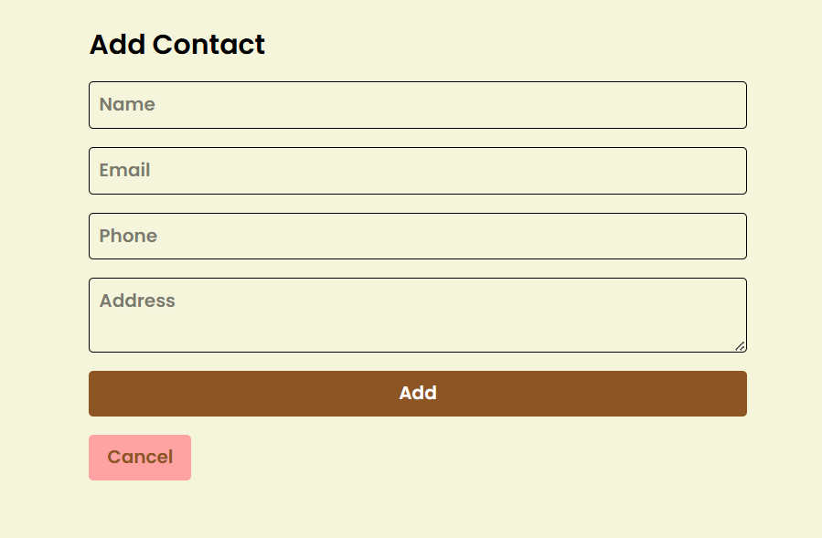

# 📇 Contact Management System

A full-stack **Contact Management System** built with the **MERN Stack** (MongoDB, Express.js, React, Node.js).  
This app allows users to **add**, **view**, **edit**, **delete**, **search**, and **sort** contacts through a clean and responsive UI.

---

## 🖼️ Project Demo

> 📸 Add these images in a `/Images` folder and update the paths accordingly

- **Landing Page**
  

- **Authentication Pages**
  
  
  
- **Add Contact**
  

- **Edit Contact**
  

- **My Contacts**
  

- **Favourite Contacts**
  

- **Search Functionality**
  

---

## 🔥 Features

- ✅ List all contacts with name, phone, and email
- ✅ Add new contacts with required validations
- ✅ Edit existing contact details
- ✅ Delete contacts
- ✅ Search by name
- ✅ Sort by name or date added
- ✅ Responsive & clean UI (mobile/tablet/desktop)

---

## 🧰 Tech Stack

| Tech         | Description                        |
|--------------|------------------------------------|
| MongoDB      | NoSQL database for storing contacts|
| Express.js   | Web framework for Node.js backend  |
| React        | Frontend library for UI rendering  |
| Node.js      | JS runtime environment (server)    |
| CSS          | UI styling                         |
| Vite         | Fast React dev server (frontend)   |

---

## 📦 Project Structure

