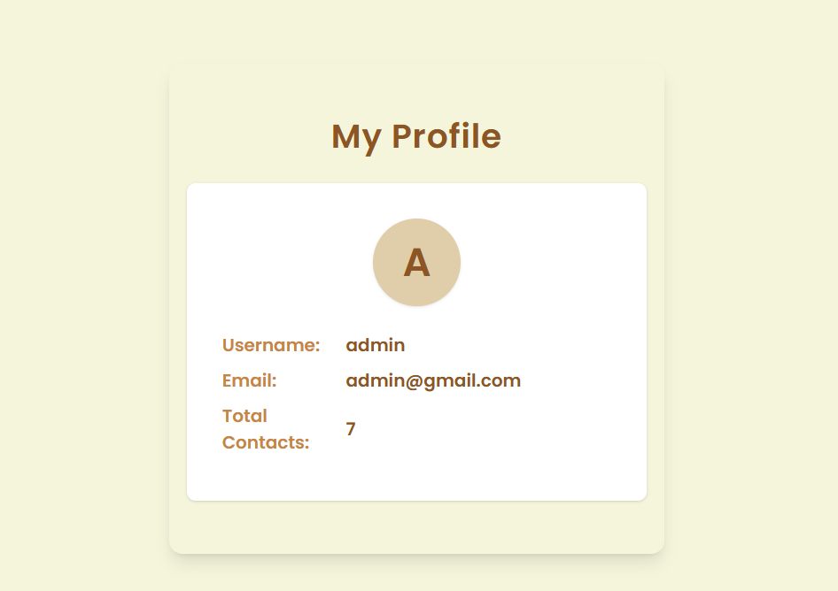

# 🚀 Full Stack Projects Repository

Welcome to the **Full Stack Projects Repository (MERN)**!  
This collection contains hands-on projects built using modern web development technologies such as **MongoDB**, **Express.js**, **React**, **Node.js**, and more.  
Each project is fully functional and includes CRUD operations, clean UIs, and responsive design.

---

## 📂 Projects Overview

### 🔹 1. Contact Management System 📇

A full-stack contact management app built using the **MERN stack**.

#### 🔧 Features:
- Add, view, edit, and delete contacts
- Search and sort functionality
- Responsive design (mobile & desktop)
- Favorite contacts
- Authentication (Login & Register)

#### 🛠 Tech Stack:
- **Frontend:** React, Vite, CSS
- **Backend:** Node.js, Express.js
- **Database:** MongoDB

## 📂 Preview




#### 📂 Project Folder: [`/ContactManagementSystem`](./ContactManagement)

---

### 🔹 2. [Coming Soon...]

Future projects will be added here.

---

## 🛠️ Setup Instructions (for each project)

Each project contains a `README.md` with:
- Features
- Tech Stack
- Installation Instructions
- Project Structure
- Screenshots
  
---

To run any project:

```bash
# 1. Clone the repository
git clone https://github.com/your-username/full-stack-projects.git

# 2. Go to the project directory
cd ContactManagementSystem

# 3. Follow frontend & backend setup as mentioned in the project README
